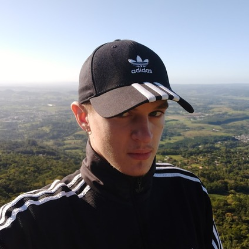
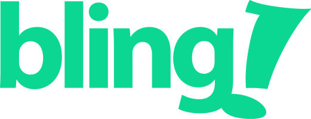
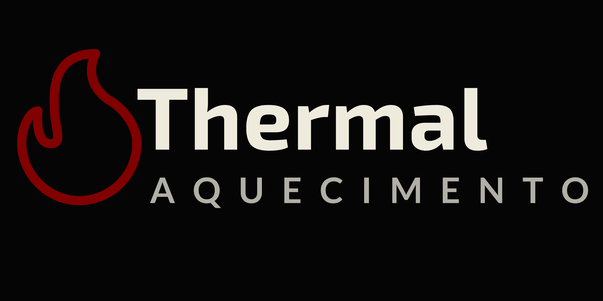
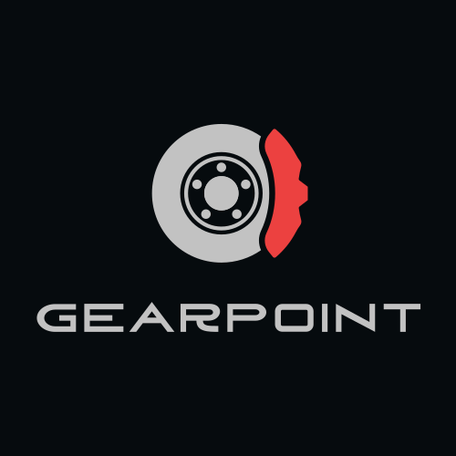

<h1>Hi there! 😼 this is luabagg.</h1>

 
    
Sometimes I try to do things and it just doesn't work out the way I wante it to.

    
<strong>I code</strong>:)

    
Best at backend development, I've used several technologies throughout my career, including Go, Python, Apache Kafka, AWS S3, Redis, Protocol Buffers and Relational Databases.

    
Flexible and open-minded, I consider all suggestions or opinions when taking my technical decisions. When receiving feedbacks, I take the opportunity to improve. I really like solving problems that require logic and brainstorming (I'm not a robot!), and being involved in complex projects as well.

    <h2>Work experience 🚀</h2>
     
    

        

            
            &nbsp;<strong>Full Stack Developer</strong>
             
            &nbsp;<a href="https://www.bling.com.br/"><strong>Bling</strong></a> • Full-time • 2020 - 2024
        

        
Acting mainly as a backend developer, I created efficient and reliable APIs and microservices, and helped optimizing the codebase. I have used many technologies, including Go programming language, Kafka, AWS S3 and AWS OpenSearch. In addition, I helped in the orientation and integration of new coworkers, introducing them to our tech stack  and supporting any possible questions.

    

     
    

        

            
            &nbsp;<strong>Web Developer</strong>
             
            &nbsp;<a href="https://thermalaquecimento.com.br/"><strong>Thermal Aquecimento</strong></a> • Co-Founder • 2022 - now
        

        
At Thermal Aquecimento, I'm in charge of the technology. I created the company website and managed social media and contracts / budget quotations.
        I have the project publicly available. You can check it at the <a href="https://github.com/thermalaquecimento" alt="Organization link">organization's GitHub</a>.

    

     
    

        

            
            &nbsp;<strong>Full Cycle Developer</strong>
             
            &nbsp;<a href="https://gearpoint.com.br/"><strong>Gearpoint</strong></a> • Co-Founder • 2023 - now
        

         
        
Gearpoint is a complete platform for cars enthusiasts. It's still under development, so stay tuned following our <a href="https://instagram.com/gearpoint.br">social media</a>, and you can also check the <a href="https://github.com/gearpoint" alt="Organization link">organization's GitHub</a>.

    

  

    <b>Find me elsewhere!</b>
    
    

 

    <h2>GitHub Stats and Projects 📌</h2>
    
    &nbsp;
    
    &nbsp;
    
    &nbsp;
    
    &nbsp;
    
    &nbsp;
    

 

    
    
    
    
    
    
    

