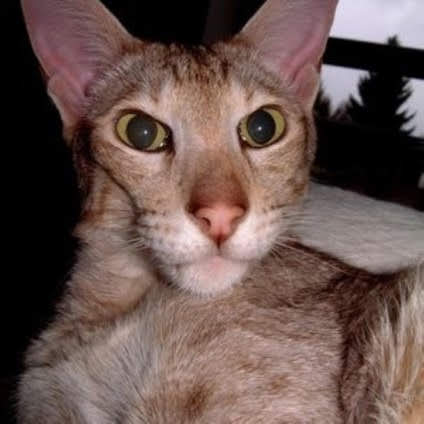
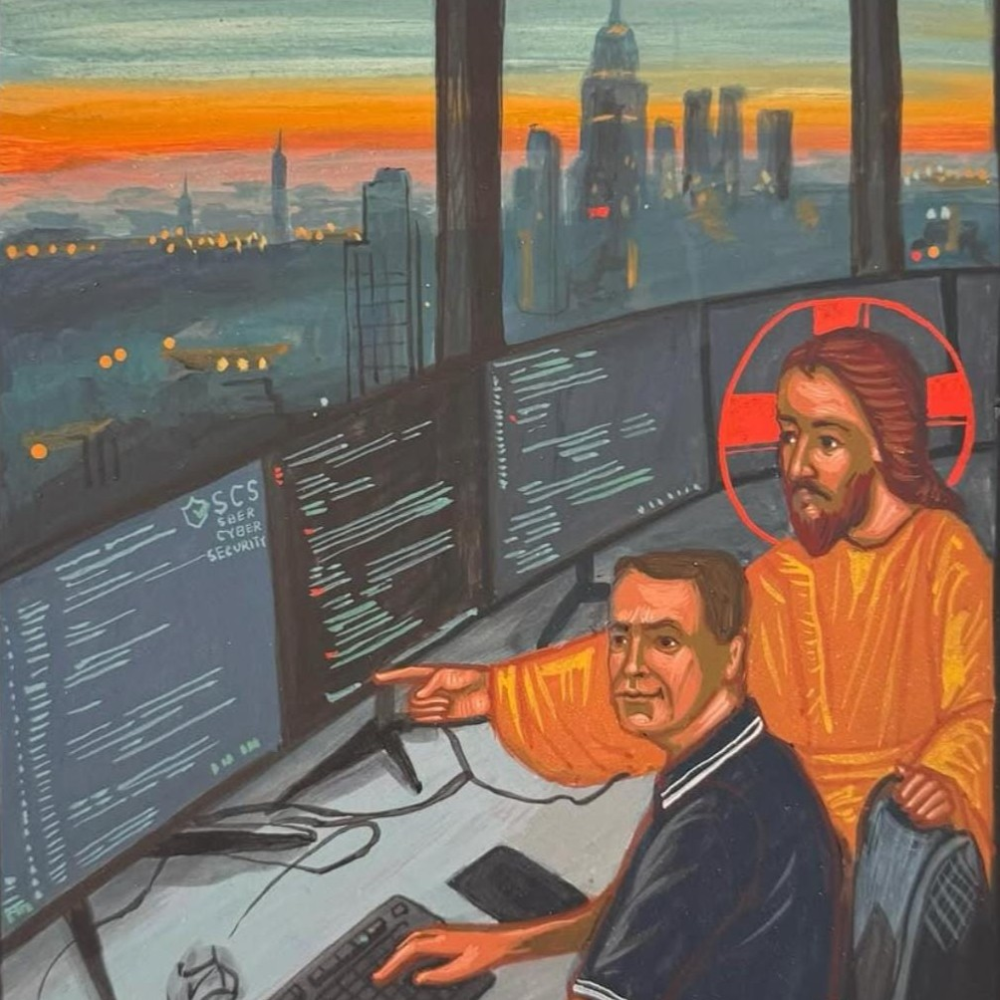

<section class="section secret-room" id="secret-room">
  <a class="secret-back" href="./">← Back to the normal world</a>

  

    
Unauthorized access detected

    <h2>WOAH! You just entered the secret room...</h2>
    

      A curated shelf of memes, relics, and questionable life choices.
      Click at your own risk.
    

  

  

    <figure class="secret-item">
      
      <figcaption> Certified office manager. </figcaption>
    </figure>

    <figure class="secret-item">
      
      <figcaption> Every frontend PR at 3 PM on a Friday. </figcaption>
    </figure>

    <figure class="secret-item">
      
      <figcaption> What relatives think I do. </figcaption>
    </figure>

    <figure class="secret-item">
      
      <figcaption> Respect. </figcaption>
    </figure>

    <figure class="secret-item">
      
      <figcaption> How it started. </figcaption>
    </figure>

    <figure class="secret-item secret-item-wide">
      
      <figcaption> The infinite wobble. Do not stare for too long. </figcaption>
    </figure>

    <figure class="secret-item">
      
      <figcaption> Core dependency. </figcaption>
    </figure>
  

</section>
