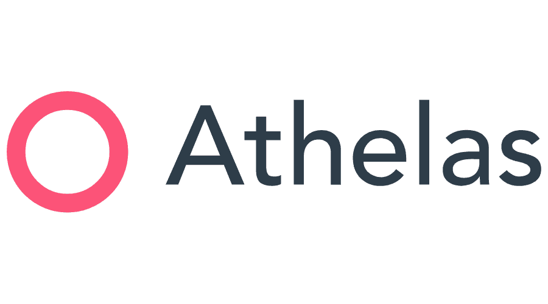
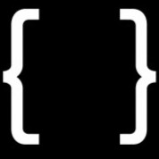
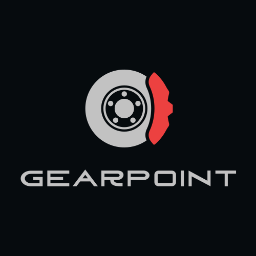
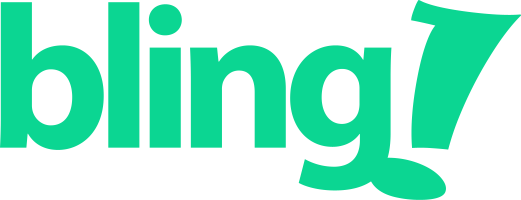
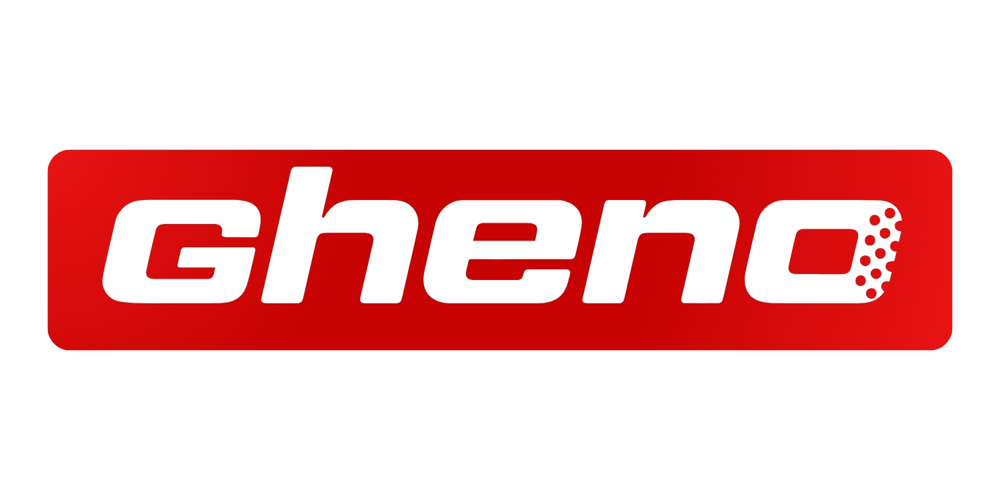
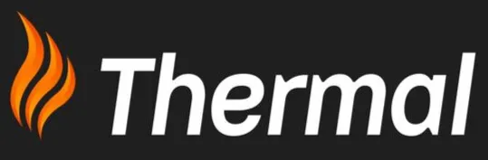

<section class="readme-section" id="intro" aria-label="Profile introduction">



{{ readme_content | markdownify }}
</section>

<section class="section stack-section" id="languages">
  

    
Languages and tools

    <h2>Core stack</h2>
    

      The practical toolkit I reach for when building product systems: APIs,
      async jobs, data-heavy workflows, and operational interfaces.
    

  

  

    <article class="stack-feature">
      Primary languages
      

        <button type="button" class="tech-dock-item">Python</button>
        <button type="button" class="tech-dock-item">Go</button>
        <button type="button" class="tech-dock-item">TypeScript</button>
        <button type="button" class="tech-dock-item">SQL</button>
        <button type="button" class="tech-dock-item">PHP</button>
      

    </article>

    

      <article>
        <h3>Backend</h3>
        
Django, FastAPI, Gin, REST APIs, gRPC, service design, queues, import pipelines.

      </article>
      <article>
        <h3>Frontend</h3>
        
React, Vue, Next.js, Remix, accessible product flows, operational interfaces.

      </article>
      <article>
        <h3>Data</h3>
        
PostgreSQL, MySQL, Redis, DynamoDB, Kafka, OpenSearch, S3, Cloud Storage.

      </article>
      <article>
        <h3>Operations</h3>
        
AWS, GCP, Terraform, Docker, CI/CD, Grafana, Sentry, PagerDuty, incident follow-up.

      </article>
    

  

</section>

<section class="section experience-section" id="experience">
  

    
Experience

    <h2>Where I’ve shipped real systems</h2>
    

      Highlights from healthcare billing, local-first ERP, a car-enthusiast
      platform, and one of Brazil’s largest ERP products.
    

  

  

    <svg class="experience-path" viewBox="0 0 20 1000" preserveAspectRatio="none" aria-hidden="true">
      <path id="career-path" d="M10,0 C14,250 6,500 10,750 C14,875 6,940 10,1000" fill="none" stroke="rgba(140,28,19,0.18)" stroke-width="2" stroke-dasharray="8 8"/>
    </svg>
    

    <ol class="experience-timeline">
      <li class="experience-entry">
        
        <article class="experience-card">
          

            
          

          

            

              2025 — now
              Software Engineer
            

            <h3>Athelas</h3>
            

              Healthcare automation platform. Shipped billing, eligibility, Charge
              Master, appointment billing, async CSV imports up to ~50k rows, and
              production support across Python, React/TypeScript, PostgreSQL, and
              GCP.
            

          

        </article>
      </li>

      <li class="experience-entry">
        
        <article class="experience-card">
          

            
          

          

            

              2024
              Software Engineer, contract
            

            <h3>Yo Lara</h3>
            

              Local-first ERP product flows, service-order workflows, and
              centralized imports using React, React Aria, SQLite, PostgreSQL, and
              PowerSync.
            

          

        </article>
      </li>

      <li class="experience-entry">
        
        <article class="experience-card">
          

            
          

          

            

              2023 — 2024
              Founding Engineer
            

            <h3>Gearpoint</h3>
            

              Built a car enthusiast social/events platform from zero to 2,000+
              beta users. Owned Django APIs, frontend flows, payments, media
              infrastructure, and AWS deployment.
            

          

        </article>
      </li>

      <li class="experience-entry">
        
        <article class="experience-card">
          

            
          

          

            

              2020 — 2024
              Software Engineer
            

            <h3>Bling</h3>
            

              One of Brazil’s leading ERP platforms. Helped introduce Go/gRPC
              services, co-owned a file management service, migrated 40TB+ of
              files, and contributed to API v3 architecture.
            

          

        </article>
      </li>
    </ol>
  

</section>

<section class="section ventures-section" id="ventures">
  

    
Selected work

    <h2>Outside-the-day-job projects</h2>
    

      Side business and client work where I handled strategy, operations, and
      the technical pieces end to end.
    

  

  

    <article class="venture-card venture-card-large venture-gheno">
      
      
      
      
      

        
      

      

        

          DOWNHILL
          ENDURO
          E-BIKE
        

        
Side business · Brazilian MTB components

        <h3>GHENO</h3>
        

          A Brazilian performance MTB components brand built around real riding
          experience and technical product selection. Direct-to-consumer
          ecommerce and B2B distribution for bike shops, workshops, and
          resellers.
        

      

    </article>

    <article class="venture-card venture-warm">
      
      

        
      

      

        
Client project · Heating services

        <h3>Thermal Aquecimento</h3>
        

          Helped my brother’s heating-services business with website work,
          contracts, and budget quotations.
        

        <a href="https://www.thermalaquecimento.com.br/" target="_blank" rel="noopener noreferrer">Visit site</a>
      

    </article>
  

</section>

<section class="section education-section" id="education">
  

    
Education

    <h2>Statistics, data, and software foundations</h2>
    

      Two programs that shaped how I think about systems, data, and the
      trade-offs behind every decision.
    

  

  

    <article class="education-card">
      

        <h3>UFSM</h3>
        Universidade Federal de Santa Maria
      

      
Statistics &amp; Data Science

      <ul class="education-badges">
        <li>Statistics</li>
        <li>Data Science</li>
        <li>Probability</li>
        <li>Statistical Modeling</li>
      </ul>
    </article>

    <article class="education-card">
      

        <h3>IFRS</h3>
        Instituto Federal do Rio Grande do Sul
      

      
Internet Computing

      <ul class="education-badges">
        <li>Web Development</li>
        <li>Programming</li>
        <li>Networking</li>
        <li>Systems Analysis</li>
      </ul>
    </article>
  

</section>

<section class="section contact-section" id="contact">
  

    
Contact

    <h2>Let&rsquo;s talk</h2>
    

      Reach out for work, collaboration, or just to say hi.
    

  

  

    <a href="mailto:luanbaggio0@gmail.com">luanbaggio0@gmail.com</a>
    <a href="https://github.com/luabagg">github.com/luabagg</a>
    <a href="https://linkedin.com/in/luabagg">linkedin.com/in/luabagg</a>
  

</section>
